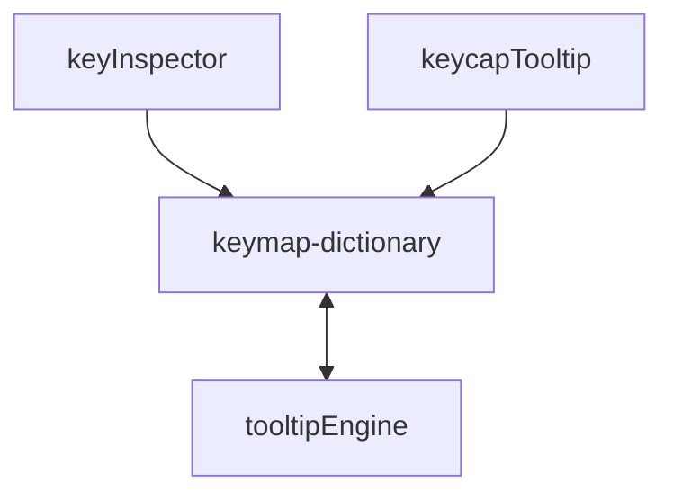
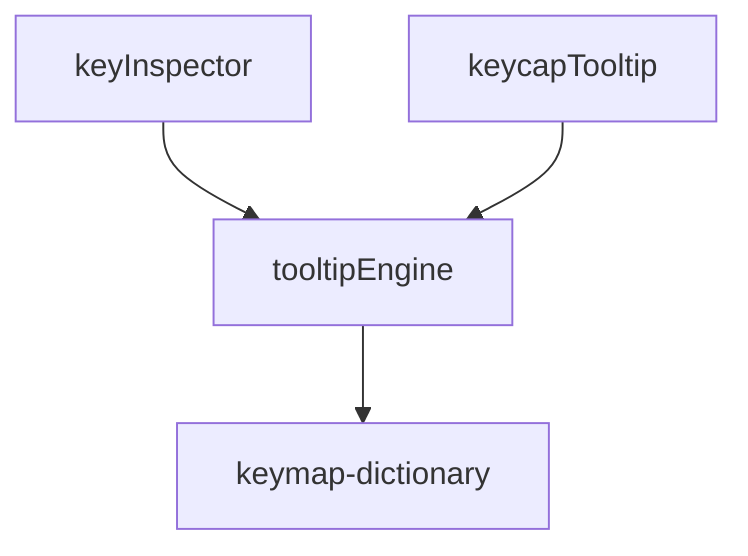

# Issue #14 の対処計画：keymap-dictionary.js のツールチップロジック分離（改訂版）

`js/keymap-dictionary.js` の肥大化を解消するため、ツールチップ生成およびパースエンジンを新設する `js/utils/tooltipEngine.js` に分離します。

AIレビュアーからの指摘を全面的に受け入れ、**循環参照（相互依存）と `keymap-dictionary.js` での re-export 案を完全に排除**し、依存関係が一方向（DAG：有向非巡回グラフ）になるよう設計を改善しました。

---

## 📐 依存関係の改善（DAGの構築）

### 改善前（循環参照の発生）


### 改善後（クリーンな一方向の依存関係）✅


これにより、モジュールの初期化エラーやバンドルツールの処理エラーのリスクを根底から排除します。

---

## User Review Required

> [!IMPORTANT]
> **外部インポートの直接修正**:
> `keymap-dictionary.js` での re-export を行わないため、`getKeycodeTooltipInfo` を直接利用している既存の以下のファイルを修正し、インポート元を `js/utils/tooltipEngine.js` へ直接向けるように書き換えます。
> - `js/utils/keyInspector.js`
> - `js/components/keycapTooltip.js`

## Proposed Changes

---

### 1. ツールチップパース・生成エンジンの分離

#### [NEW] [tooltipEngine.js](file:///c:/Git/KeymappingViewer/js/utils/tooltipEngine.js)
- `js/keymap-dictionary.js` から以下の定数・ヘルパー・公開API関数を完全に移動・新設します。
- **依存関係（一方向）**:
  ```javascript
  import { QMK_KEYCODE_METADATA } from '../qmk-keycode-metadata.js';
  import { resolveKeycodeAlias } from '../keymap-dictionary.js';
  ```
- **移植対象の静的マップ・定数**:
  - `preferredOfficialKeycodeDisplay`, `tooltipWrapperTokens`, `tooltipWrapperAliasMap`, `tooltipTemplateAliasMap`, `tooltipModTapDescriptions`, `modifierWrapperExpansion`, `tooltipModifierNameByStyle`
- **移植対象のヘルパー関数**:
  - `splitTopLevelArgs`, `canonicalizeTooltipAtom`, `normalizeKeyStyle`, `getStyledModifierName`, `formatModifierList`, `collectModifierChain`, `formatDirectDescriptionForKeyStyle`, `extractWrappedExpressionParts`, `getDirectKeycodeDescription`, `getViaSpecificDescription`, `getCompositeKeycodeDescription`, `isWrappedExpression`
- **移植対象の公開API関数**:
  - `toCanonicalKeycodeDisplay`, `getKeycodeDescription`, `getKeycodeTooltipInfo`

#### [MODIFY] [keymap-dictionary.js](file:///c:/Git/KeymappingViewer/js/keymap-dictionary.js)
- 移植した定数および L1231 以降のすべてのツールチップ生成コードを完全に削除し、約1,200行まで軽量化します。
- 使用しなくなる `import { QMK_KEYCODE_METADATA }` のインポート宣言を削除します。
- **重要**: `tooltipEngine.js` への依存や re-export は一切行いません。これにより、辞書ファイルとしての純粋なデータ・エイリアス解決責務に専念させます。

---

### 2. インポート箇所の直接修正

#### [MODIFY] [keyInspector.js](file:///c:/Git/KeymappingViewer/js/utils/keyInspector.js)
- `getKeycodeTooltipInfo` のインポート元を `tooltipEngine.js` に変更します。
  ```diff
  -import { getKeycodeTooltipInfo } from '../keymap-dictionary.js';
  +import { getKeycodeTooltipInfo } from './tooltipEngine.js';
  ```

#### [MODIFY] [keycapTooltip.js](file:///c:/Git/KeymappingViewer/js/components/keycapTooltip.js)
- `getKeycodeTooltipInfo` のインポート元を `tooltipEngine.js` に変更します。
  ```diff
  -import { getKeycodeTooltipInfo } from '../keymap-dictionary.js';
  +import { getKeycodeTooltipInfo } from '../utils/tooltipEngine.js';
  ```

---

## Verification Plan

### Automated Tests
- 新設する `tooltipEngine.js` を網羅的に検証するため、`test/utils/tooltipEngine.test.js` を新規に作成します（変換、説明文生成、エイリアス構造体の組み立て等を徹底テスト）。
- テストコマンド: `npm run test` （追加したテストを含む35件以上のすべてのテストケースがパスすることを確認）
- Linterコマンド: `npm run lint` （警告数に増減や問題が発生しないことを確認）

### Manual Verification
- `npm start` でローカル開発サーバーを起動し、ブラウザで `http://127.0.0.1:5501` にアクセス。
- ラッパーキー、レイヤー操作キーなどのツールチップがエラーなく正常に以前と同様に表示されることを確認します。
